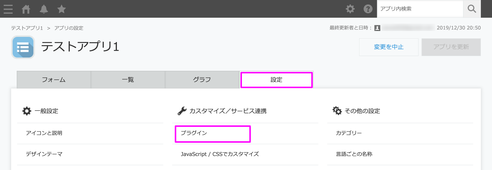
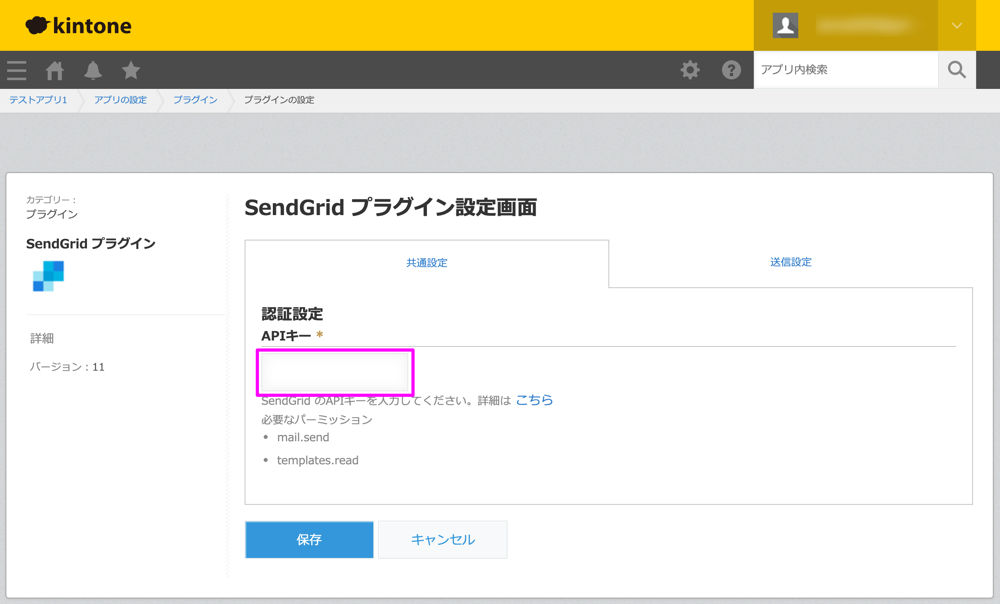
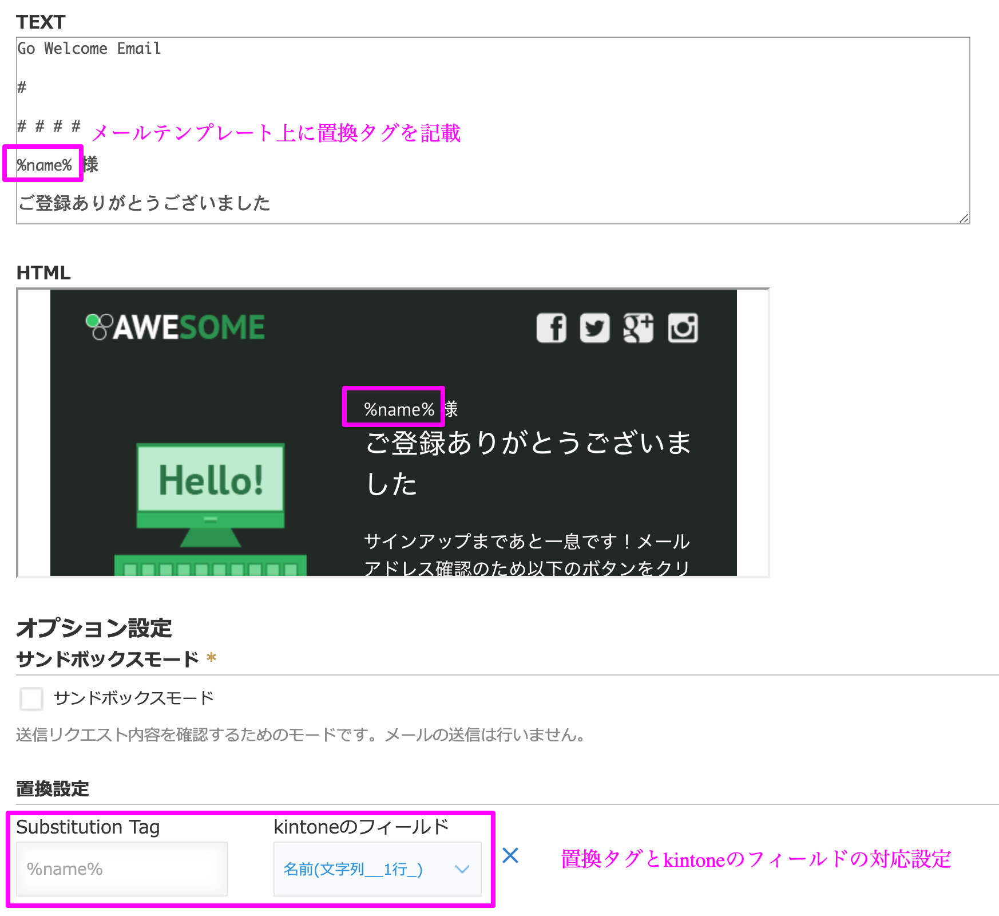
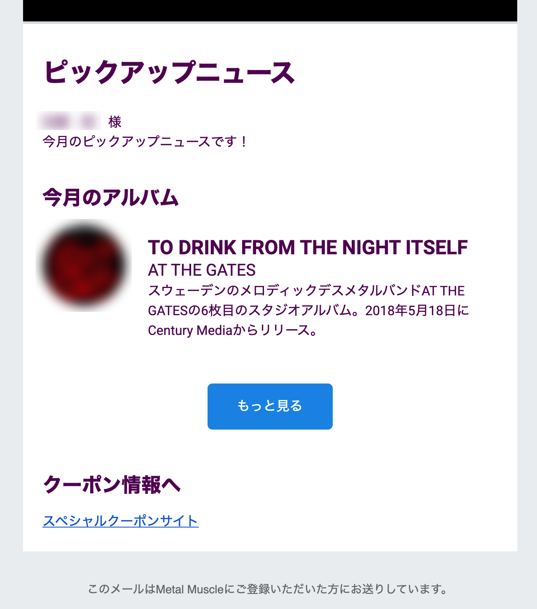

# SendGrid kintoneプラグインとは
本プラグインはkintoneからSendGridを利用してメール送信するためのものです。kintone上で管理している顧客リストや会員リストなどに対して、メールを一斉送信できます。

メールのテンプレートはSendGridの[Webポータル](https://sendgrid.com/templates/)上で編集します。メール本文に対して宛先ごとに文字の埋め込み（宛名やクーポンコードなど）を行うことができます。

# ライセンス
本プラグインは[MITライセンス](https://github.com/SendGridJP/kintone-sendgrid-plugin/blob/master/LICENSE.txt)で提供されています。

# 前提条件
本プラグインを利用する前に次のものを用意してください。

- [kintone](https://kintone.cybozu.com/jp/)のシステム管理権限を持ったアカウント
- [SendGrid](https://sendgrid.kke.co.jp)のアカウント

# 利用方法

## kintoneアプリの準備
SendGrid kintoneプラグインが動作するためにアプリ側では宛先アドレスを格納するフィールドが必要になります。宛先アドレスを格納するフィールドは次の条件を満たしている必要があります。

- 値の重複を禁止していること
- 「文字列(1行)」フィールドまたは、「リンク」フィールド(入力値の種類＝メールアドレス)であること

具体的な設定画面は次のとおりです。

- 文字列(1行)フィールドの場合  
値の重複を禁止する必要があります。

- リンクフィールドの場合  
値の重複を禁止し、入力値の種類を「メールアドレス」にする必要があります。

## プラグインのインストールと有効化

### プラグインの読み込み
最新版のプラグインを[こちらからダウンロード](https://github.com/SendGridJP/kintone-sendgrid-plugin/blob/master/plugin.zip?raw=true)して読み込みます。詳しい手順は[こちら](https://help.cybozu.com/ja/k/admin/plugin.html)を参照してください。

※プラグインの改変が必要な場合は、GitHubからソースコードを取得して[plugin-sdk](https://github.com/kintone/plugin-sdk)でパッケージングしたものを読み込んでください。パッケージングの手順は[こちら](https://developer.cybozu.io/hc/ja/articles/203283794)をご確認ください。

### アプリへのプラグインの追加
「**アプリの設定 > 設定 > プラグイン**」からSendGridプラグインを追加します。

## プラグインの設定
プラグインを追加したら **歯車アイコン** をクリックしてSendGridプラグインの設定画面を開きます。

### APIキーの設定
**共通設定** タブでSendGridのAPIキーを設定します。SendGridの[Webポータル](https://app.sendgrid.com/settings/api_keys)でAPIキー(必要なパーミッションについてはプラグインの設定画面を参照)を生成します。生成したAPIキーを設定画面内のテキストボックスに貼り付けます。

### メール設定
次に送信設定タブを選択します。メール設定ではFrom（メールの送信元アドレス）、Toフィールド（宛先アドレスを格納するフィールド）の設定を行います。

### テンプレート設定
テンプレート設定では、送信するメール本文のタイプ（マルチパートまたはテキスト）と、標準で使用するテンプレートを選択します。テンプレートは[SendGridのダッシュボード上](https://sendgrid.com/templates)で行います。詳しい手順については[ドキュメント](https://sendgrid.kke.co.jp/docs/Tutorials/A_Transaction_Mail/using_templates.html#-Edit)を参照してください。テンプレート編集後、「**テンプレートの取得**」ボタンを選択してテンプレート選択プルダウンを更新してください。

### 置換設定
置換設定では、テンプレート上の置換用タグと対応するkintoneフィールドを設定できます。この設定を利用することで、メール本文に宛先ごとに異なる文字列をkintoneのフィールドから取得して埋め込むことができます。

以下はメール本文中の「%name%」タグをkintoneの姓フィールドの値で置換してメール送信する例です。

### 設定の保存

設定が完了したら「保存」ボタンを選択して設定を保存します。

最後にkintoneのアプリ設定を更新してください。

## メール送信

一覧画面の上部にメールテンプレートの選択ドロップダウンとメール送信ボタンが表示されるので、レコードを絞り込んでメール送信ボタンを選択することでメール送信されます。

この際、宛先フィールドが空のレコードについては送信対象外となります。また、置換設定を行った場合、テンプレート上の置換タグが各レコードの対応するフィールドの値に置換されてメール送信されます。

本文内の置換タグが対応するフィールドの値に置換されてメール送信されます。

