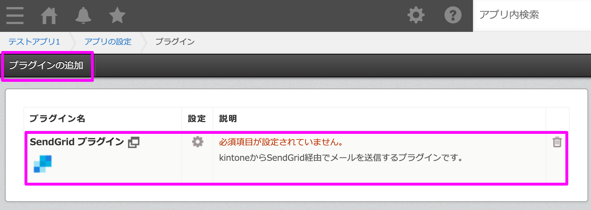
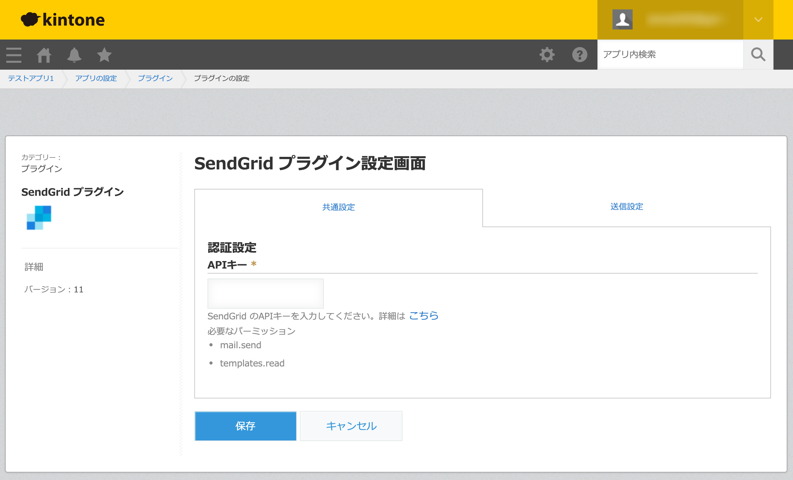
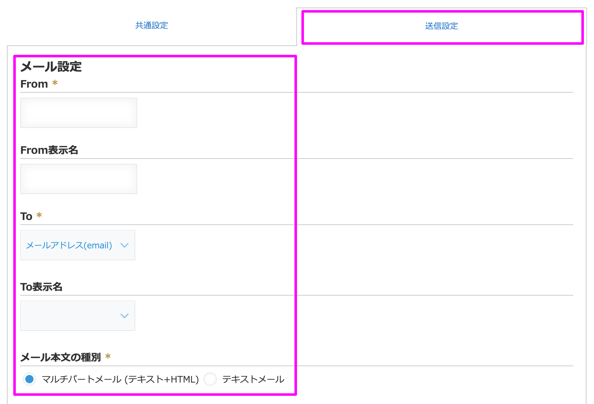
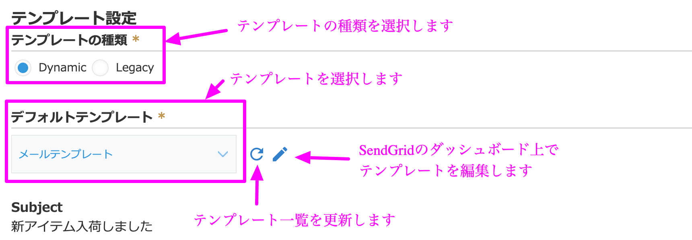
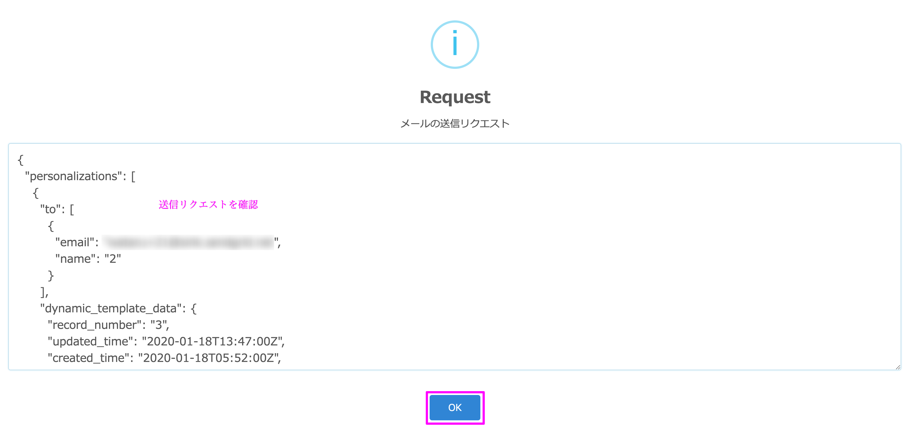

# SendGrid kintoneプラグインとは
本プラグインはkintoneからSendGridを利用してメール送信するためのものです。kintone上で管理している顧客リストや会員リストなどに対して、メールを一斉送信できます。メールのテンプレートはSendGridの[Webダッシュボード](https://sendgrid.com/templates/)上で編集します。メール本文に対して宛先ごとに文字の埋め込み（宛名やクーポンコード）などを行うことができます。

# ソースコード
[こちらのリポジトリ](https://github.com/SendGridJP/kintone-sendgrid-plugin)にて公開しています。

# ライセンス
[MITライセンス](https://github.com/SendGridJP/kintone-sendgrid-plugin/blob/master/LICENSE.txt)で提供しています。

# サポートとカスタマイズ
ご不明な点がございましたら、[GithubリポジトリのIssue](https://github.com/SendGridJP/kintone-sendgrid-plugin/issues)よりお問い合わせください。

機能改善や不具合修正については[Pull Request](https://github.com/SendGridJP/kintone-sendgrid-plugin/pulls)を受け付けています。ただし、機能改善については汎用的なものに限ります。プラグインのカスタマイズが必要な場合は、利用者ご自身で行なってください。その際、[plugin-sdk](https://github.com/kintone/plugin-sdk)でパッケージングする必要があります。パッケージングの手順は[こちら](https://developer.cybozu.io/hc/ja/articles/203283794)をご確認ください。

[こちらのサポート窓口](https://support.sendgrid.kke.co.jp/hc/ja)ではプラグインのサポートやカスタマイズは**承っておりません**。ご了承ください。

# 前提条件
- [kintone](https://kintone.cybozu.com/jp/)のシステム管理権限を持ったアカウント
- [SendGrid](https://sendgrid.kke.co.jp)のアカウント

# 利用方法

## 1. kintoneアプリの準備
本プラグインが動作するためにアプリ側では宛先アドレスを格納するフィールドが必要になります。宛先アドレスとして指定可能なフィールドは以下いずれかである必要があります。

- 「文字列(1行)」フィールド
- 「ラジオボタン」フィールド
- 「ドロップタウン」フィールド
- 「リンク」フィールド

## 2. プラグインのインストールと有効化

### 2-1. プラグインの読み込み
最新版のプラグインを[こちらからダウンロード](https://github.com/SendGridJP/kintone-sendgrid-plugin/blob/master/dist/plugin.zip?raw=true)して読み込みます。詳しい手順は[こちら](https://help.cybozu.com/ja/k/admin/plugin.html)を参照してください。

### 2-2. アプリへのプラグインの追加
「**アプリの設定 > 設定 > プラグイン**」からSendGridプラグインを追加します。

## 3. プラグインの設定
プラグインを追加したら **歯車アイコン** をクリックしてSendGridプラグインの設定画面を開きます。

### 3-1. APIキーの設定
**共通設定** タブでSendGridのAPIキーを設定します。SendGridの[Webダッシュボード](https://app.sendgrid.com/settings/api_keys)でAPIキーを生成します。APIキーに必要なパーミッションについてはプラグインの設定画面を参照してください。生成したAPIキーを設定画面内のテキストボックスに貼り付けます。

### 3-2. メール設定
次に、**送信設定** タブを選択します。メール設定ではFrom（メールの送信元アドレス）、From表示名、To（宛先アドレスを格納するフィールド）、To表示名、メール本文の種別（マルチパートまたはテキスト）の設定を行います。ToとTo表示名は対応するKintoneフィールドを選択します。

### 3-3. テンプレート設定
テンプレート設定では、テンプレートの種類（DynamicまたはLegacy）、標準で使用するテンプレートを選択します。テンプレートはSendGridのダッシュボード上で編集します。詳しい手順は以下を参照してください。

- [Dynamicテンプレートの編集](https://sendgrid.kke.co.jp/docs/Tutorials/A_Transaction_Mail/using_dynamic_templates.html)
- [Legacyテンプレートの編集](https://sendgrid.kke.co.jp/docs/Tutorials/A_Transaction_Mail/using_templates.html)

テンプレート編集後、テンプレート一覧を更新してください。

### 3-5. サンドボックスモード
サンドボックスモードを有効にすると、メール送信リクエストの内容を確認できるようになります。設定内容を確認する際にご利用ください。サンドボックスモードを無効にするとメール送信ができるようになります。

### 3-6-1. 置換設定
Legacyテンプレートを選択した場合、置換設定が利用できます。置換設定では、テンプレート上の置換用タグと対応するkintoneフィールドを指定します。この設定を利用することで、メール本文に宛先ごとに異なる文字列をkintoneのフィールドから取得して埋め込むことができます。

以下はメール本文中の「%name%」タグをkintoneの「名前」フィールドの値で置換してメール送信する例です。

### 3-6-2. Dynamic Template Data設定
Dynamicテンプレートを選択した場合、Dynamic Template Data設定が利用できます。Dynamic Template Data設定では、テンプレート上のタグと対応するkintoneフィールドを指定します。この設定を利用することで、メール本文に宛先ごとに異なる文字列をkintoneのフィールドから取得して埋め込んだり、if句の条件指定やイテレータを利用することができます。

以下はメール本文中の「%name%」タグをkintoneの名前フィールドの値で置換してメール送信する例です。

### 3-5. 設定の保存

設定が完了したら「保存」ボタンを選択して設定を保存します。

最後にkintoneのアプリ設定を更新してください。

## 4. メール送信

一覧画面の上部にメールテンプレートの選択ドロップダウンとメール送信ボタンが表示されるので、レコードを絞り込んでメール送信ボタンを選択します。

### 4-1. 送信リクエストのチェック

設定画面でサンドボックスモードを有効化した状態で、メール送信ボタンを選択するとサンドボックスモードの旨メッセージが表示されます。「OK」ボタンを選択するとデバッグ用にメール送信リクエストのパラメータが表示されます。さらに「OK」ボタンを選択すると、メールの送信リクエストのチェック結果を表示します。

### 4-2. メール送信

設定画面でサンドボックスモードを無効化した状態でメール送信ボタンを選択すると、メール送信前に確認メッセージが表示されます。「送信」ボタンを選択することでメール送信されます。

宛先フィールドが空のレコードについては送信対象外となります。一方、同じ宛先のレコードが複数指定された場合、同じ宛先に複数通送信されます。

置換設定を行った場合、テンプレート上の置換タグが各レコードの対応するフィールドの値に置換されてメール送信されます。

